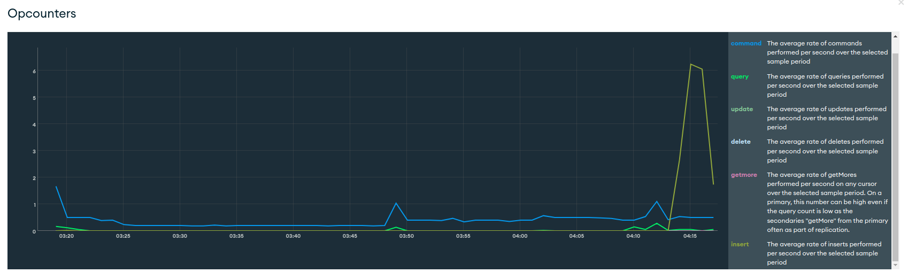
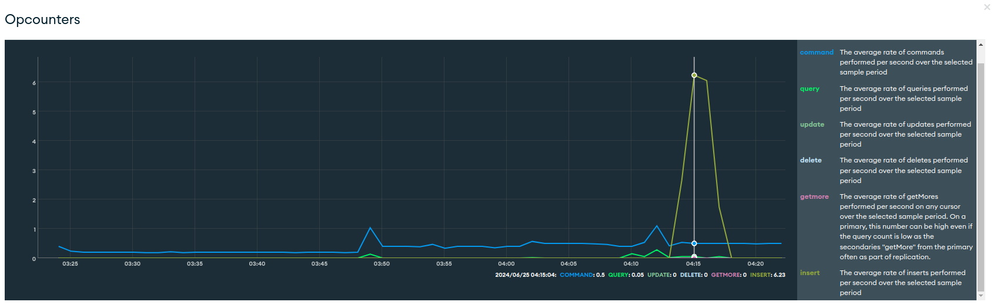
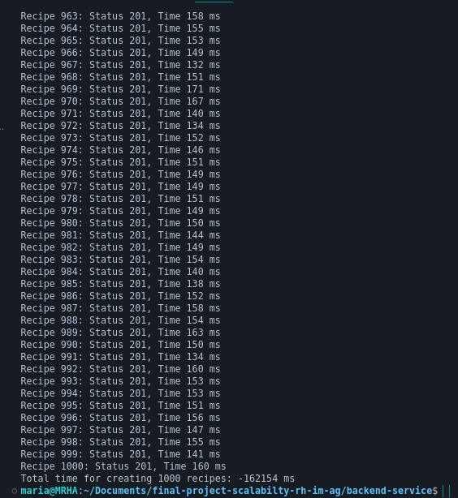
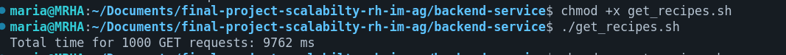
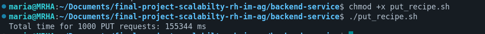
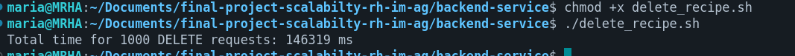
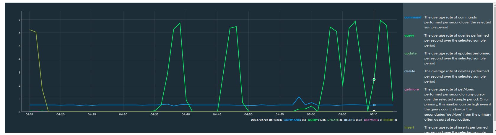

# Final project, system scalability

## MongoDB
### Test using endpoint POST, using 1000 datas

Steps:
- Open the terminal
- Verify existing create_recipes.sh file
- Give execution permissions "chmod +x create_recipes.sh"
- Run the file "./create_recipes.sh"

Results in terminal:

### Test using endpoint GET by ID, using 1000 datas and ID = "667a443d6c156834d9b46da9"

Steps:
- Open the terminal
- Verify existing get_recipes.sh file
- Give execution permissions "chmod +x get_recipes.sh"
- Run the file "./get_recipes.sh"

### Test using endpoint PUT, using 1000 datas and ID = "667a443d6c156834d9b46da9"

Steps:
- Open the terminal
- Verify existing put_recipes.sh file
- Give execution permissions "chmod +x put_recipes.sh"
- Run the file "./put_recipes.sh"

### Test using endpoint DELETE, using 1000 datas and ID = "667a43f66c156834d9b46bdf"

Steps:
- Open the terminal
- Verify existing delete_recipes.sh file
- Give execution permissions "chmod +x delete_recipes.sh"
- Run the file "./delete_recipes.sh"

### Final results in Mongo Atlas

Note: as you can see all actions are recorded in mongo atlas.
- The update was tried several times and as it failed it was also shown, but it was not taken as an update, but rather as a GET.