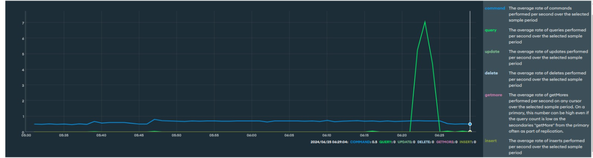

# Final project, system scalability

## Features implemented

### 1. MongoDB Atlas instead of PostgreSQL

Switching from PostgreSQL to MongoDB Atlas for managing unstructured data brings significant benefits:

1. **Schema Flexibility**: MongoDB's flexible schema design is ideal for dynamic data models, unlike PostgreSQL's rigid structure.
2. **Document-Oriented Storage**: MongoDB's BSON format simplifies storing and querying complex, hierarchical data.
3. **Scalability and Performance**: MongoDB's native horizontal scalability handles large volumes of unstructured data more efficiently.
4. **Cloud Management**: MongoDB Atlas provides fully managed services, automating backups, security, and monitoring.
5. **Querying and Indexing**: MongoDB offers powerful querying and indexing for JSON-like documents, enhancing performance and simplicity.

Overall, the switch to MongoDB Atlas enhances flexibility, scalability, and performance for unstructured data management, leading to improved system efficiency and easier maintenance.

### 2. **Backend Creation on .NET**

.NET is a powerful framework developed by Microsoft for building a wide range of applications, including web, mobile, desktop, and more. Here’s why it’s beneficial for backend development:

- **Performance**: .NET is known for its high performance and reliability.
- **Rich Libraries**: .NET offers a vast library of pre-built components, which speeds up development.
- **Scalability**: Designed to handle high-demand enterprise applications, making it a solid choice for scalable backend services.

### 3. **YARP Reverse Proxy for Load Balancing and Horizontal Scalability**

YARP (Yet Another Reverse Proxy) is a reverse proxy library built by Microsoft. It is designed to create reverse proxy applications easily.

_Using Round robin_

- **Load Balancer**: YARP can distribute incoming network traffic across multiple backend servers, balancing the load to ensure no single server is overwhelmed.
- **Horizontal Scalability**:
  - **How it Works**: By distributing the load, YARP allows your application to scale horizontally. This means you can add more servers to handle increased traffic instead of upgrading a single server.
  - **Benefits**:
    - **Improved Performance**: Evenly distributed traffic prevents bottlenecks and enhances response times.
    - **Fault Tolerance**: If one server fails, the load balancer redirects traffic to the remaining healthy servers, ensuring high availability.

### 4. **Microservices Architecture and Load Balancer for API Services**

Microservices architecture is an approach to software development where a large application is composed of small, independent services that communicate over a network.

- **Microservices**:

  - **Modularity**: Each microservice is a separate unit that focuses on a specific business function.
  - **Independence**: Services can be developed, deployed, and scaled independently.
  - **Technological Diversity**: Different services can be built using different technologies that best suit their requirements.

- **Load Balancer in Microservices**:
  - **Purpose**: A load balancer distributes incoming requests among the different microservice instances.
  - **Benefits**:
    - **Scalability**: Easily scale services by adding more instances without downtime.
    - **Resilience**: Enhance fault tolerance and high availability. If one instance goes down, the load balancer reroutes the traffic to the healthy instances.
    - **Efficiency**: Optimize resource utilization by ensuring no single instance is overburdened.

## MongoDB previous results

### Test using endpoint POST, using 1000 datas

Steps:

- Open the terminal
- Verify existing create_recipes.sh file
- Give execution permissions "chmod +x create_recipes.sh"
- Run the file "./create_recipes.sh"

Results in terminal:

### Test using endpoint GET by ID, using 1000 datas and ID = "667a443d6c156834d9b46da9"

Steps:

- Open the terminal
- Verify existing get_recipes.sh file
- Give execution permissions "chmod +x get_recipes.sh"
- Run the file "./get_recipes.sh"

### Test using endpoint PUT, using 1000 datas and ID = "667a443d6c156834d9b46da9"

Steps:

- Open the terminal
- Verify existing put_recipes.sh file
- Give execution permissions "chmod +x put_recipes.sh"
- Run the file "./put_recipes.sh"

### Test using endpoint DELETE, using 1000 datas and ID = "667a43f66c156834d9b46bdf"

Steps:

- Open the terminal
- Verify existing delete_recipes.sh file
- Give execution permissions "chmod +x delete_recipes.sh"
- Run the file "./delete_recipes.sh"

### Final results in Mongo Atlas

Note: as you can see all actions are recorded in mongo atlas.

- The update was tried several times and as it failed it was also shown, but it was not taken as an update, but rather as a GET.

## MongoDB actual results applying horizontal scalability

### Test using endpoint POST, using 1000 datas

Steps:

- Open the terminal
- Verify existing create_recipes.sh file
- Give execution permissions "chmod +x create_recipes.sh"
- Run the file "./create_recipes.sh"

Results in terminal:

### Test using endpoint GET by ID, using 1000 datas and ID = "667a443d6c156834d9b46da9"

Steps:

- Open the terminal
- Verify existing get_recipes.sh file
- Give execution permissions "chmod +x get_recipes.sh"
- Run the file "./get_recipes.sh"

### Test using endpoint PUT, using 1000 datas and ID = "667a443d6c156834d9b46da9"

Steps:

- Open the terminal
- Verify existing put_recipes.sh file
- Give execution permissions "chmod +x put_recipes.sh"
- Run the file "./put_recipes.sh"

### Test using endpoint DELETE, using 1000 datas and ID = "667a43f66c156834d9b46bdf"

Steps:

- Open the terminal
- Verify existing delete_recipes.sh file
- Give execution permissions "chmod +x delete_recipes.sh"
- Run the file "./delete_recipes.sh"

## Conclusion

The implementation of these new features has significantly enhanced the performance and scalability of the system. Integrating MongoDB Atlas instead of PostgreSQL allows us to efficiently manage unstructured data. Building the backend on .NET provides a high-performance, cross-platform solution with rich libraries that streamline development and maintenance. The use of YARP as a reverse proxy enables effective load balancing, ensuring that our system can handle increased traffic with improved response times and fault tolerance. Adopting a microservices architecture, complemented by the load balancer, has opened up the possibility for seamless horizontal scaling and improved resilience. Overall, these advancements have resulted in a robust, flexible, and high-performing system capable of meeting the growing demands of our applications and services.
